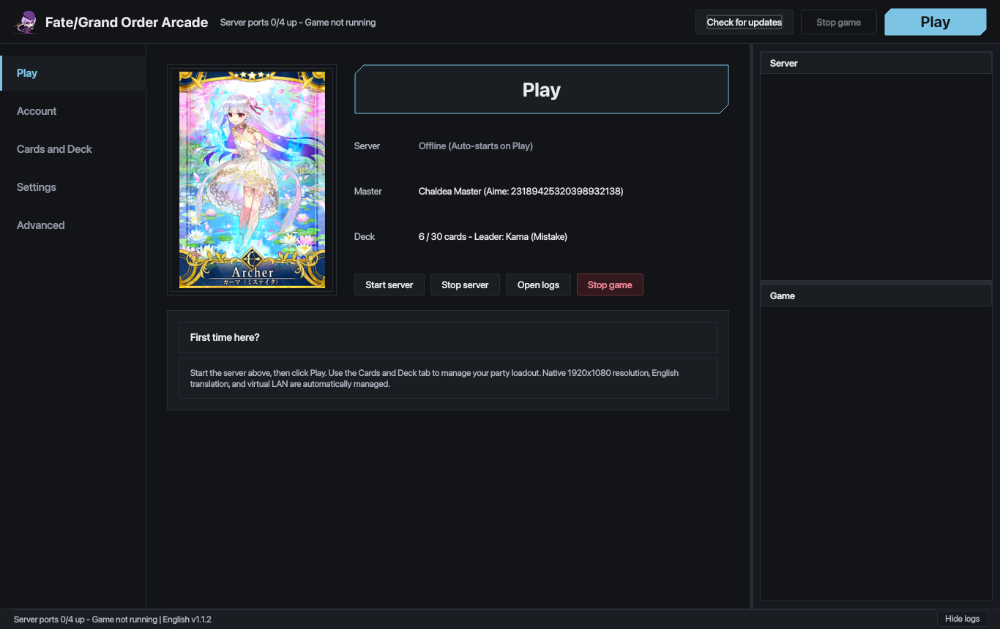
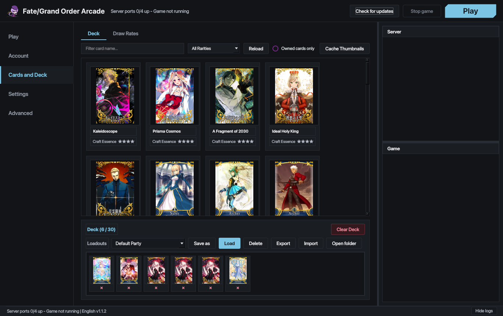
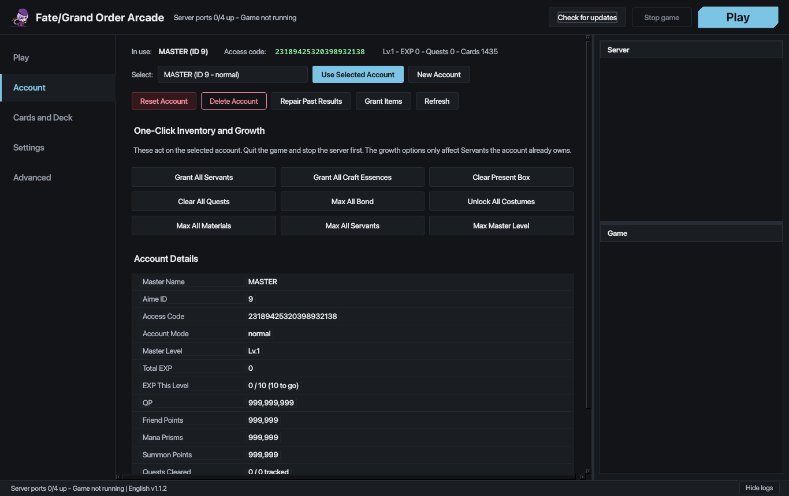
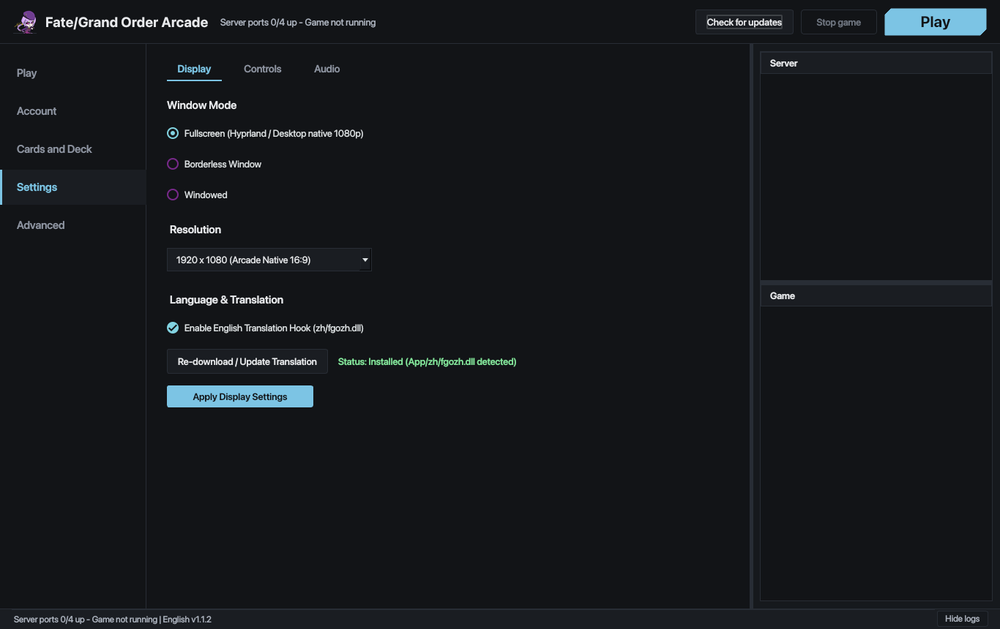

# Fate/Grand Order Arcade - Linux Launcher Overlay

[](https://www.python.org/)
[](https://www.riverbankcomputing.com/software/pyqt/)
[](https://kernel.org/)
[](LICENSE)

A high-performance, native Linux launcher and runtime orchestration overlay for **Fate/Grand Order Arcade**. Engineered as a **straight-up 1:1 Linux port of Scooby's launcher UI design** ([githubuser420x/FGOAC-scooby](https://github.com/githubuser420x/FGOAC-scooby)) rebuilt natively in Python and PyQt6 to attach directly onto **Cloud23333's FGO Arcade rip**, providing a seamless native desktop arcade experience without Windows or virtual machines.

---

## Highlights

- **1:1 Port of Scooby's Arcade Cabinet Aesthetic**: Direct 1:1 recreation of Scooby's WPF launcher theme featuring 45-degree chamfered geometry, responsive cyan glows, and crisp typography.
- **On-Demand Embedded Server Stack**: Auto-starts local MariaDB (port 3307) and Artemis server (ports 8777, 8443, 22345) when launching the game, and automatically shuts them down on exit—zero background overhead when not playing.
- **One-Click Translation Downloader**: Built-in button in Settings to automatically fetch, verify SHA256, and deploy the English translation package (`zh/fgozh.dll` + sprites) directly from GitHub.
- **Card Catalog & Deck Builder**: Visual browser covering 3,700+ card artwork bitmaps. Includes ascension stages, Fatal (foil) variants, multi-copy selection, and an interactive 30-slot deck shelf.
- **Deck Loadout Management**: Save, load, export, and import multiple team compositions (`App/deck-loadouts/`) with real-time leader portrait updates.
- **Account & Master Management**: Real-time master stats overview and 9 one-click inventory and account tools (QP, Saint Quartz, Mana Prisms, All Servants, All Craft Essences, Max Bond, Max Skills).
- **Universal Linux Game Launcher**: Auto-detects GPU configurations (NVIDIA `prime-run`, AMD/Intel `RADV`), manages Wayland / Hyprland tearing and fullscreen rules, injects translation hooks (`zh/fgozh.dll`), and synchronizes network routing.
- **Automated Diagnostics**: 8-point system integrity check validating executables, hooks, artwork, translation files, network IP bindings, and scripts.

---

## Interface Showcase

| Arcade Play Dashboard | Card Catalog & 30-Slot Loadouts |
|:---:|:---:|
|  |  |
| **Account Management & Growth Tools** | **Settings & Keybindings** |
|  |  |

---

## Credits & Attributions

We gratefully acknowledge the creators and contributors whose work makes running Fate/Grand Order Arcade on Linux possible:

- **UI Design (1:1 Port / Copy)**: **[Scooby](https://github.com/githubuser420x/FGOAC-scooby)**  
  This launcher's interface is a faithful, straight-up 1:1 Linux port of Scooby's original Windows WPF launcher design, replicating the authentic arcade cabinet aesthetic, 45-degree chamfered buttons, color scheme, navigation layout, and deck builder for the Linux desktop.

- **Platform & Server Rip**: **Cloud23333**  
  Special credit and appreciation to Cloud23333 for the Fate/Grand Order Arcade package, Artemis server integration, database administration tools, and platform backend.

- **Game Intellectual Property**:  
  *Fate/Grand Order Arcade* is developed by **Sega Corporation** and **Type-Moon** / **Lasengle**. This repository contains only open-source launcher and orchestration code and distributes no proprietary game binaries or assets.

---

## Prerequisites

Ensure the following packages are installed on your Linux distribution:

### Arch Linux / Manjaro
```bash
sudo pacman -S python python-pyqt6 python-yaml wine mariadb net-tools
```

### Ubuntu / Debian
```bash
sudo apt install python3 python3-pyqt6 python3-yaml wine mariadb-server iproute2
```

### Fedora
```bash
sudo dnf install python3 python3-pyqt6 python3-pyyaml wine mariadb-server iproute
```

---

## Installation & Setup

### Method 1: Latch Onto an Existing FGOA Rip (Recommended)

1. Clone or download this repository:
   ```bash
   git clone https://github.com/Min34r/fgo-ac-loonix.git
   cd fgo-ac-loonix
   ```

2. Run `install.sh` targeting your extracted Cloud FGOA rip folder:
   ```bash
   ./install.sh /path/to/FGOA
   ```
   *(Add `--desktop` if you would like an application menu shortcut created).*

3. Verify the installation:
   ```bash
   ./install.sh --check /path/to/FGOA
   ```

### Method 2: Clone Directly Into FGOA Root

You can also clone or extract the repository directly into your Cloud FGOA game directory and run:
```bash
cd /path/to/FGOA
./install.sh
```

### Optional: Wine Prefix & CJK Fonts Setup

If configuring on a fresh Linux installation, initialize your Wine prefix with CJK font support and DLL overrides:
```bash
./scripts/setup_prefix.sh /path/to/FGOA/wineprefix
```

---

## Arcade Loopback Network (192.168.100.1)

Fate/Grand Order Arcade expects the local cabinet server at `192.168.100.1`. When playing locally, the launcher will automatically attempt to bind this alias on-demand, or you can bind it manually:

```bash
sudo ip addr add 192.168.100.1/24 dev lo
```

---

## Controllers & Input Mapping

FGO Arcade supports keyboard, PlayStation DualSense, Xbox controllers, and arcade fight sticks.
See the comprehensive [**Controller Configuration Guide**](docs/CONTROLLERS.md) for button mappings, touch screen simulation, and Steam Input setup.

---

## Launching

From the game directory, start the launcher:

```bash
./FGO_Launcher.sh
```

### Headless Verification Test
To verify the launcher and Qt stack without launching the GUI:
```bash
./FGO_Launcher.sh --headless-test
```

---

## Repository Structure

```
fgoa-launcher/
├── FGO_Launcher.sh              # Root launcher entrypoint
├── install.sh                   # Automated overlay installer & environment checker
├── requirements.txt             # Python dependencies
├── LICENSE                      # MIT License & attribution notice
├── README.md                    # Project documentation
├── docs/
│   └── CONTROLLERS.md           # Gamepad, arcade stick & touch mapping guide
├── assets/
│   └── screenshots/             # Interface showcase images
├── deck-loadouts/               # Starter 30-card team loadout presets
│   ├── Default Party.json
│   └── Mash Kyrielight Starter.json
├── scripts/
│   ├── launch_linux.sh          # Universal GPU-detecting game runner
│   ├── setup_prefix.sh          # Automated Wine prefix & font installer
│   ├── install_translation.sh   # CLI English translation downloader & installer
│   ├── patch_server_artemis.sh  # Artemis Python 3.12+ & Linux compatibility patcher
│   ├── start_server_native.sh   # Native MariaDB + Artemis server starter
│   ├── stop_server_native.sh    # Native server stack stopper
│   └── mariadb_native.cnf.template # Dynamic MariaDB configuration template
└── launcher/
    ├── fgo_launcher.py          # Application entrypoint
    ├── assets/
    │   ├── platform.png         # High-resolution 256x256 application icon
    │   └── platform.ico         # Legacy application icon
    ├── core/
    │   ├── config.py            # Centralized dynamic path resolver
    │   ├── translation_installer.py # In-app translation downloader & extractor
    │   ├── card_catalog.py      # Card bitmap scanner and deck serializer
    │   ├── game_process.py      # Non-blocking QProcess runner
    │   ├── network_sync.py      # Virtual LAN / loopback synchronization
    │   └── server_manager.py    # Socket monitor and service manager
    └── ui/
        ├── chamfer.py           # 45° chamfered buttons & container widgets
        ├── theme.py             # Palette, colors, and global QSS styles
        ├── main_window.py       # Main window, navigation, and log drawer
        ├── play_view.py         # Play dashboard & leader card portrait
        ├── account_view.py      # Profile metrics & 1-click inventory tools
        ├── cards_view.py        # Card catalog grid & deck shelf
        ├── settings_view.py     # Display, keybindings, and audio settings
        └── advanced_view.py     # Network sync, 8-point diagnostics, and About
```

---

## License

This project is released under the [MIT License](LICENSE).
See [LICENSE](LICENSE) for full details and acknowledgments.
